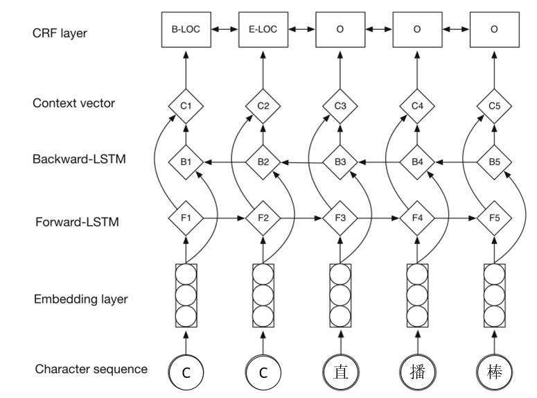

# 主播命名实体识别

## 背景介绍

智能机器人生成弹幕的语料库中的部分预料含有名字、昵称等实体，在匹配到相关弹幕即将发送时，需要把该部分无一般性的实体进行截取和处理才可以成为生成弹幕。因此需要设计算法对在线弹幕进行主播命名实体识别，部分实体数据如下所示。

```
若欣 最好了~
格格大美女好
婷婷才是我喜欢的
我去看看京京
```

那么，我们需要从上述数据中提取出**若欣**、**格格大美女**、**婷婷**以及**京京**这几个主播名字实体。

## 模型基本结构

这边做了个初始版本的**biLSTM+CRF**的模型，结构如下。



​		

## 模型调用

模型实验环境是基于**python3**的，以下python依赖。

```
numpy >= 1.16.2
temsorflow >= 1.13.1
six >= 1.12.0
```


该模型只在少数训练数据上（464条标注数据，对应**data_anchor**文件）进行了训练，并把模型调优结果保存在**checkpoint**中。

若是训练模型，则调用下面代码。

```python
from model import biLSTMwithCRF

model = biLSTMwithCRF(ckpt_dir='checkpoint/')
model.load_data() # 读入数据
model.build() # 构建模型
model.train() # 训练模型
```

若是调用模型进行预测，则调用下面代码。

```python
from model import biLSTMwithCRF

model = biLSTMwithCRF(ckpt_dir='checkpoint/')
model.build() # 构建模型
model.load_model() # 加载模型
model.predict('小姐姐我爱你么么。') # 预测数据
```
