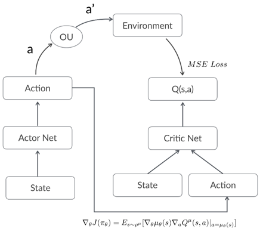

# DDPG深度强化学习

## 背景介绍

DDPG是常用的实时更新预测的深度强化推荐算法，其建模想法是A-C网络，具体的知识介绍可以查看**doc**文件夹下的文档**Deep Learning based Recommender System.docx**。

把该算法的思想应用到直播间的推荐上，即使用深度学习网络为用户推荐候选主播，然后根据用户的点击行为实时更新奖励并以此作为样本更新网络，其基本结构如下。



## 模型构建

由于在线训练方式实现成本较高，因此在搭建了适应于本地训练测试的网络结构，具体改变如下。

- **状态向量的编码**

  用户观看历史的主播的嵌入向量与观看时长进行加权平均编码

- **离线奖励的计算**

  Actor网络计算得到的输出向量和下一观看主播嵌入向量的softmax交叉熵

- **下一状态的更新**

  使用滑动平均的更新方式，将前一时间段的状态向量与当前Actor网络计算得到的输出向量、观看时长进行组合

- **网络的更新策略**

  Actor网络与Critic网络交替更新，并使用双网络更新以及soft更新等策略

## 代码文件
实验环境基于**python3**进行，需要用到以下依赖。

```
numpy >= 1.16.2
temsorflow >= 1.13.1
six >= 1.12.0
```

为了方便进行实验，把代码文件分成以下三部分存放在**code**文件夹下。

- **ddpg.py**：模型文件，存放DDPG模型类

- **ddpg_data_process.py**：数据预处理文件，存放数据预处理函数

- **ddpg_train.py**：模型训练文件，用于数据预处理、模型搭建以及模型训练预测

## 评估结果

初步发现DDPG暂不适用于当前直播主播的离线推荐任务，总结原因如下。

- DDPG适用于有大量用户交互的环境下使用，通过用户跟推荐系统产生的动作进行交互产生实时奖励和实时状态更新以及DDPG网络的更新。因此DDPG对实验环境要求具有一定的实时性并且数据量要足够大，不然网络的训练会不稳定而且不具有指导意义；若是离线训练，则需要根据当前动作计算奖励和下一轮的状态，不存在用户与模型的交互，不契合DDPG的思想。

- 状态的编码方式通过主播的嵌入向量进行，所以还需要对该嵌入向量进行预训练或者用主播的已有特征进行编码，而预训练的任务形式在当前的环境下难以确定；同时DDPG等DRL深度学习算法会偏向于推荐用户的常看记录，其探索性较差，若考虑增加推荐效果的多样性，则DDPG不适用。

